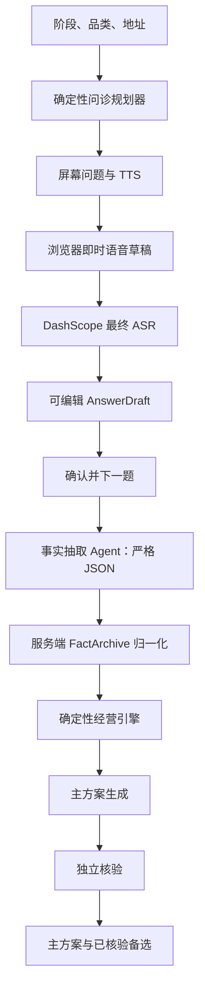

# 店判交接文档

更新：2026-07-24（Asia/Shanghai）  
仓库：`Vist233/ShopValidator`  
生产：<https://shopvalidator.zhangyvjing.com>  
演示：<https://demo.shopvalidator.zhangyvjing.com>  
案例榜：<https://shopvalidator.zhangyvjing.com/ranking>

## 当前状态

Cloudflare Worker 名称为 `yongge`，技术栈为 Worker + Static Assets + D1 + Queue + Durable Object。`main` 最新提交：`cf64ae0`（已推送 `origin/main`）。已部署版本 `457d4e61-3f49-4e2d-8a6d-c9449ea95780`，主站与演示站均 200，生产 `app.js` 已确认含本轮全部代码。

本轮以三个原子提交完成、一次部署上线：

| 包 | 提交 | 内容 |
|---|---|---|
| 1 语音 UX | `a6613c6` | 问诊提交后左上角固定显示「正在整理你的回答」（单行、无副标题）；新增 `stopVoiceIo()` 在手动确认/上一题/重开时立即切断 ASR 请求、麦克风送流、TTS 播放与 TTS 请求；迟到的 ASR/TTS 结果按 `turnId` 与 `submitInFlight` 守卫丢弃，不再写入界面；本地降级保留 0.8 秒防闪屏 |
| 2 重复出题修复 | `7265e55` | 服务端根因修复：提交后统一用「已合并事实 + 已记轮次」的最新状态重算下一题，抽取模型超时/报错的兜底路径不再回吐刚答过的问题；客户端收到 409 版本冲突时直接采用服务器返回的最新问题；新增模型故障不再重复出题的回归测试 |
| 3 真实阶段进度 | `cf64ae0` | 服务端新增 `createRunProgressSink`，按 phase 变化节流、串行落库，轮询方不再只看到 `queued`；前端删除 900ms 定时表演，改为 `ANALYSIS_PHASES` 映射 + 已审候选比例驱动，`setAnalysisProgress` 单调不回退；新增阶段落库回归测试 |

关键验证：回答“最近一个月营业额十万元”会在生产案卷写入 `monthlyRevenue=100000`，下一题稳定推进为 `variableCostRate`，不重复第一题；6 项固定 + 3 项自适应按策略顺序推进、零重复。

## 核心规则：6–12 问

地址、阶段、品类在问诊前确认，不计入问题数。

| 阶段 | 固定六项 |
|---|---|
| 已营业 | 月营收、变动成本率、月固定成本总额（含老板劳动）、可用现金、债务、最大断点 |
| 准备开店 | 总投入、可用现金、债务、月固定成本、变动成本率、真实付费验证 |
| 增长 | 月营收、变动成本率、月固定成本、可用现金、产能、增长断点 |

- `interview-policy.js` 是问题顺序、上限和结束条件的唯一权威。
- `MAX_TURNS=12`，每字段最多一次。
- “不知道”写为 `unknown`，绝不换句式追问。
- 固定六项结束后，仅在核心事实足够且判断确有需要时补问；目前默认最多补三项，12 是硬上限。
- Agent 只能抽取事实，不能决定下一问；`sanitizeAgentNextQuestion()` 会回到程序策略。

## Agent 与事实架构



### 关键实现边界

- 浏览器即时识别先写入草稿；DashScope 最终转写仅在用户未手改时更新草稿。
- 只有用户点击“确认并下一题”才会写入案卷和推进问题。
- VAD 静音结束为 350ms，前端与 Worker 一致。
- `AnswerDraft` 状态包含 `turnId / draft / draftEdited / draftSource`。
- Worker 的 `canonicalInterviewFacts()` 是唯一归一化入口，内部经 `normalizeServerFacts()` 执行字段白名单、数值、周期、范围、单位及未知校验。
- `deterministicAnswerFact()` 仅在模型超时或返回空事实时，对**当前确定性字段**进行受限兜底，防止数字丢失；不要将其扩展为自由文本推理。
- `fixedCostTotal` 是新核心字段。旧案卷只有房租、人工、其他固定成本时，`FactStore` 只会在老板劳动成本未明确为未知时派生总固定成本。

## 前端状态

首页没有重做。问诊页只保留当前问题、`第 X / 6 · 最多补至 12`、草稿框、确认按钮与暂停/继续。

提交后左上角提示只显示单行「正在整理你的回答」，无副标题。手动确认/上一题/重开会调用 `stopVoiceIo()` 立即切断语音输入输出；迟到的 ASR/TTS 结果按 `turnId` 守卫丢弃。

结果页只展示中文结论、3 个关键数字、判断说明、主方案和已核验备选。完整事实与现场证据收进 `<details>`。结论中文映射为：`可以继续`、`小步验证`、`停止追加`、`准备退出`。Loading 使用与顶部一致的“判”标志。

### 分析进度条（真实阶段驱动）

进度条只由服务器上报的真实阶段推进，无定时表演，且单调不回退：

- 服务端 `createRunProgressSink` 在 phase 变化（或每 4 秒）时把进度落库，`persistRun` 的 upsert 不触碰 claim 字段，轮内落库安全。
- 前端 `ANALYSIS_PHASES` 映射：`queued 8` → `round-start 12` → `generate 33` → `verify-evidence 50` → `verify-execution 66` → `round-complete 85` → `completed 100`。
- `renderRunProgress` 取「阶段百分比」与「8 + 已审比例×87」的较大值；`setAnalysisProgress` 用 `state.analysisFloor` 保证只增不减。
- 本地降级只保留 0.8 秒防闪屏，不做假进度。
- 演示站（`demo.shopvalidator.zhangyvjing.com`）保留刻意的分段时间线（16→42→66→88→96→结果约 7.2 秒），与真实站是两套逻辑，由 `DEMO_MODE` 分流。

## 匿名案例榜

### 隐私边界

私有案卷在 `cases` 表中，设计寿命为 24 小时。公开榜使用独立 D1 表：`public_cases` 与 `public_case_outcomes`。

公开快照绝不能包含精确地址、身份、音频、原始转写、案卷令牌、完整账目或金额型核心事实。允许显示阶段、品类、中文结论、非敏感信号、主/备选方案和证据分。

### 资格与排序

- 数据丰富度至少 70；
- 有非 `EVIDENCE` 确定性结论；
- 当前分析完成，且至少一条方案通过核验；
- 结果页默认尝试匿名发布，失败不影响私有结果；
- 本机 `localStorage` 保存管理令牌，结果页可下架自己的案例。

排行榜完全不调用 Agent：

`排行榜分 = 70% 数据丰富度 + 30% 结果改善度`

改善度支持 `revenue / orders / gross_margin / cost / cash_burn`。成本与现金消耗按下降更好；无可比回填时结果分为 0。

### API

| API | 用途 |
|---|---|
| `GET /api/leaderboard` | 获取仅含公开快照的榜单 |
| `POST /api/cases/:caseId/publish` | 使用私有案卷令牌匿名发布 |
| `POST /api/public-cases/:id` | 使用管理令牌回填结构化前后数据 |
| `DELETE /api/public-cases/:id` | 使用管理令牌下架案例 |

## 部署与数据库

- 配置：`wrangler.toml`
- 构建：`build_site.py`
- 发布：`deploy.sh`
- D1：`yongge-cases`，绑定名 `DB`
- 已执行生产迁移：`migrations/0002_public_cases.sql`

常规发布：

```bash
cd output/adventurex-restaurant-decision
./deploy.sh
```

脚本运行静态检查、Node 测试、构建、dry-run 和正式部署。网络不稳时先走本地 `7897` 代理，再直接重试。

不要提交 `.env`、Cloudflare Secrets、生产案卷、音频、原始转写或案例管理令牌。

## 已完成验证

- `test_fact_store.js`
- `test_decision_engine.js`
- `test_interview_policy.js`
- `test_server_decision_adapter.mjs`
- `test_dashscope_asr_client.mjs`
- `test_dashscope_tts_client.mjs`
- `test_stepfun_client.mjs`
- `test_agent_orchestrator.js`
- `test_worker.mjs`（含本轮新增：模型故障不重复出题回归、阶段落库回归）
- 全部 14 个 `node --check` 与 9 个 node 测试文件通过；`./deploy.sh` 一次部署成功。
- 生产 `GET /api/leaderboard` 返回 `{"cases":[]}`（空榜正常）
- 生产文字问诊：数字入档、问诊进度为 `1 / 6 / 12`、问题不重复。
- 浏览器实测（生产）：提交后 250ms 左上角为「正在整理你的回答」；Q1 月营收 → Q2 变动成本率 → Q3 固定成本 → Q4 可用现金 → Q5 债务，策略顺序、零重复。
- 演示站回归：完整流程通过，分段时间线 16→42→66→88→96 单调、约 7.2 秒出结果，结果页正常渲染，无 console 报错。

## 已知遗留（非本轮范围）

- 纠偏页部分字段仍显示原始字段名（如 `fixedCostTotal`、`bottleneck`）而非中文标签，属既有小瑕疵，未在本轮修复。

## 后续优先级

1. 补齐主站真人 E2E 的 Q6–Q9（断点 + 3 项自适应）与真实站分析阶段的浏览器实时观测；本轮已用 node 回归覆盖，但浏览器实时走查因页面被导航到 `about:blank` 中断未完成。
2. 修复纠偏页原始字段名显示为中文标签。
3. 增加普通用户的榜单结果回填表单；后端 API 已就绪，前端尚未提供此表单。
4. 当前 Worker 目标数为 2、并发为 1；若要严格“主方案核验通过后才生成备选”，继续重构 `agent-orchestrator.js` 的生成时序。
5. 增加 Playwright 视觉回归基线。
6. 审视 `analysis_runs`、审计表和公开案例的长期保留/级联清理策略。

## 常见排障

- `/api/leaderboard` 404：通常是静态文件上传成功但 Worker 未切换；重新 `wrangler deploy --config wrangler.toml`，再 curl 验证。
- 页面显示数字但结果未采纳：检查 `/turns` 响应的 `extractedFacts`。应含当前字段、归一化数值、周期与状态；检查 `deterministicAnswerFact()` 与 `canonicalInterviewFacts()`。
- 问题重复：本轮已在服务端根因修复——提交后统一用最新状态重算下一题；若再现，检查 `worker.mjs` 提交后是否调用 `working.currentQuestion = nextQuestion(working)`，以及前端是否重用 `turnId`。
- 进度条卡在 `queued` 或来回跳：检查 `createRunProgressSink` 是否在两处 `onProgress`（`runAnalysis` 与 `processAnalysisQueueMessage`）都接入；前端应只走 `renderRunProgress`，不得再有定时 setInterval 表演。
- 无法公开：检查丰富度≥70、分析 `completed`、且有通过核验的方案；三项均为故意门槛。
- 编辑本目录文件报 save failed：iCloud 同步竞态导致，工具偶报失败/陈旧读取；务必用 Read 或 `git diff` 复核实际落盘状态，不要盲目重试。
