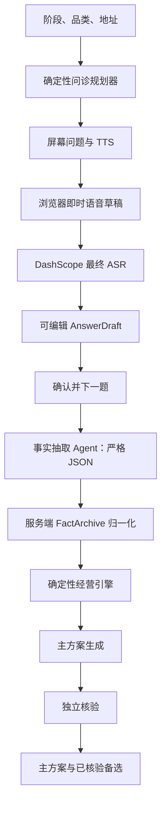

# 店判交接文档

更新：2026-07-24（Asia/Shanghai）  
仓库：`Vist233/ShopValidator`  
生产：<https://shopvalidator.zhangyvjing.com>  
演示：<https://demo.shopvalidator.zhangyvjing.com>  
案例榜：<https://shopvalidator.zhangyvjing.com/ranking>

## 当前状态

Cloudflare Worker 名称为 `yongge`，技术栈为 Worker + Static Assets + D1 + Queue + Durable Object。`main` 最新提交：`20ed41c`（已推送 `origin/main`）。已部署版本 `9e4c574f-8f48-41ae-b5f4-d6cf7087cd80`，主站与演示站均正常。

2026-07-25 的待提交修复：完整分析已取消按日、按 IP 的次数限制；Worker 不再调用 `consumeDailyAnalysisBudget()`。选址报告任意失败都会进入可返回的失败卡，不会错误显示 100% 后留在空白结果页。已补浏览器回归覆盖此失败状态；生产临时案卷实测在旧 IP 已触及原限制的情况下仍成功完成一份报告，随后已删除测试案卷。

在既有问诊/分析链路之上，最近三轮新增了「preopen 地图直出选址报告」能力（细节见下文专节）：

| 轮 | 提交 | 内容 |
|---|---|---|
| 地图选址报告 | `ff47482`…`d9d32cd` | preopen 阶段跳过语音问诊，确认位置后一次同步 LLM 直出「能不能开」报告；「我不知道」→ 推荐 3 个品类（A>B>C），指定品类 → 可行性判断；新增 `test_site_report.mjs` 并纳入 `deploy.sh` 门禁；服务端 LLM 与 22 秒超时竞速兜底，客户端该请求 40 秒超时 |
| demo 入口与阶段默认值 | `2077ba2`、`902151d` | 首页 hero 移除运城小碗菜 demo 链接；demo 入口只在判店表单最后一行、且仅「已经营业 / 有利润想增长」显示（`#panelDemoLink`）；preopen 默认「我不知道」+ 默认地址，切到后两个阶段清空默认并隐藏「我不知道」chip |
| 报告卡片与落库 | `45e8838`、`6af4d54`、`20ed41c` | 卡片正文改为「该品类为什么适合这里」（`plan.mechanism`，每卡不同），验证动作单列「怎么验证」；site-map 报告与所选品类/位置持久化到 D1（报告存为 completed `analysis_run`，`GET /api/cases/:id/runs/:runId` 可取回）；同案卷版本复用 run id，重复生成原地更新，不再触发唯一约束 500 |

关键验证（既有链路未动）：回答“最近一个月营业额十万元”会在生产案卷写入 `monthlyRevenue=100000`，下一题稳定推进为 `variableCostRate`，不重复第一题；6 项固定 + 3 项自适应按策略顺序推进、零重复。

## 选址报告（preopen 地图直出模式）

「准备开店 / 接店」不再进入语音问诊：确认位置后 CTA 为「下一步：生成选址报告」，前端 `startSiteReport()` 以 `mode: "site-map"` 调 `POST /api/cases/:id/analyze`，服务端 `runSiteReport()` 同步直出（响应 `status:"complete"` + `runId` + `result`）。

- 品类「我不知道」→ `reportType=recommend`：按客群与竞争排序推荐 3 个品类（推荐A>B>C）；指定品类 → `reportType=feasibility`：判断能不能开，给 2-3 条现场核对与低成本验证步骤。所有输出强制「需现场验证」。
- 服务端 LLM 调用与 22 秒超时竞速，失败/超时回落确定性地理报告（规则：竞品≤8 且有客群 → GO；竞品≥20 或无客群 → STOP；其余 TEST）。客户端该请求超时 40 秒。
- 结果页复用既有结构，按 `reportMode:"site-map"` 分流：结论映射「值得开 / 先小成本验证 / 不建议开」；指标卡来自 `siteMetrics`（800米同类竞品 + 环境信号）。
- 卡片契约：标题 = 品类（`plan.title`），正文 = 该品类为什么适合这里（`plan.mechanism`，每卡必须非空且互不相同），验证动作单独标注「怎么验证」；不得把通用验证话术放在品类标题下的正文位。
- 落库：报告生成后把所选品类写入 `record.category` 与 `record.facts.category`，完整报告存为 completed `analysis_run` 并回填 `latestRunId`，`GET /api/cases/:id/runs/:runId` 可直接取回。同一案卷版本复用既有 run id 原地更新（`analysis_runs` 有 `(case_id, case_version)` 唯一约束）。
- site 案卷暂不参与匿名榜：`publishCase` 依赖 `result.top3` 与核验方案，site 结果是 `topPlans`，发布会 422，前端静默忽略（与既往行为一致）。

### 阶段默认值与 demo 入口

`applyStageContext(stage)`（由 `chooseStage` 调用）统一处理：

- preopen：品类默认「我不知道」（chip 可见），地址预填默认（杭州余杭礼贤路湖畔科创中心）。
- 已经营业 / 有利润想增长：清掉「我不知道」默认与默认地址（并经 `clearConfirmedLocation()` 重置已确认位置），chip 隐藏，必须填真实品类与地址；CTA 恢复「开始问诊并持续录音」，走原语音问诊。
- 运城小碗菜 demo 链接已从首页 hero 移除，只在判店表单最后一行（`#panelDemoLink`）且仅上述两个阶段显示。

## 核心规则：6–12 问

地址、阶段、品类在问诊前确认，不计入问题数。注意：「准备开店」现已走地图直出选址报告、不再进入问诊，下表 preopen 行仅保留在 `interview-policy.js` 中备用。

| 阶段 | 固定六项 |
|---|---|
| 已营业 | 月营收、变动成本率、月固定成本总额（含老板劳动）、可用现金、债务、最大断点 |
| 准备开店 | 总投入、可用现金、债务、月固定成本、变动成本率、真实付费验证 |
| 增长 | 月营收、变动成本率、月固定成本、可用现金、产能、增长断点 |

- `interview-policy.js` 是问题顺序、上限和结束条件的唯一权威。
- `MAX_TURNS=12`，每字段最多一次。
- “不知道”写为 `unknown`，绝不换句式追问。
- 固定六项结束后，仅在核心事实足够且判断确有需要时补问；目前默认最多补三项，12 是硬上限。
- Agent 只能抽取事实，不能决定下一问；`sanitizeAgentNextQuestion()` 会回到程序策略。

## Agent 与事实架构



### 关键实现边界

- 浏览器即时识别先写入草稿；DashScope 最终转写仅在用户未手改时更新草稿。
- 只有用户点击“确认并下一题”才会写入案卷和推进问题。
- VAD 静音结束为 350ms，前端与 Worker 一致。
- `AnswerDraft` 状态包含 `turnId / draft / draftEdited / draftSource`。
- Worker 的 `canonicalInterviewFacts()` 是唯一归一化入口，内部经 `normalizeServerFacts()` 执行字段白名单、数值、周期、范围、单位及未知校验。
- `deterministicAnswerFact()` 仅在模型超时或返回空事实时，对**当前确定性字段**进行受限兜底，防止数字丢失；不要将其扩展为自由文本推理。
- `fixedCostTotal` 是新核心字段。旧案卷只有房租、人工、其他固定成本时，`FactStore` 只会在老板劳动成本未明确为未知时派生总固定成本。

## 前端状态

首页没有重做。问诊页只保留当前问题、`第 X / 6 · 最多补至 12`、草稿框、确认按钮与暂停/继续。

提交后左上角提示只显示单行「正在整理你的回答」，无副标题。手动确认/上一题/重开会调用 `stopVoiceIo()` 立即切断语音输入输出；迟到的 ASR/TTS 结果按 `turnId` 守卫丢弃。

结果页只展示中文结论、3 个关键数字、判断说明、主方案和已核验备选。完整事实与现场证据收进 `<details>`。结论中文映射为：`可以继续`、`小步验证`、`停止追加`、`准备退出`。Loading 使用与顶部一致的“判”标志。

### 分析进度条（真实阶段驱动）

进度条只由服务器上报的真实阶段推进，无定时表演，且单调不回退：

- 服务端 `createRunProgressSink` 在 phase 变化（或每 4 秒）时把进度落库，`persistRun` 的 upsert 不触碰 claim 字段，轮内落库安全。
- 前端 `ANALYSIS_PHASES` 映射：`queued 8` → `round-start 12` → `generate 33` → `verify-evidence 50` → `verify-execution 66` → `round-complete 85` → `completed 100`。
- `renderRunProgress` 取「阶段百分比」与「8 + 已审比例×87」的较大值；`setAnalysisProgress` 用 `state.analysisFloor` 保证只增不减。
- 本地降级只保留 0.8 秒防闪屏，不做假进度。
- 演示站（`demo.shopvalidator.zhangyvjing.com`）保留刻意的分段时间线（16→42→66→88→96→结果约 7.2 秒），与真实站是两套逻辑，由 `DEMO_MODE` 分流。

## 匿名案例榜

### 隐私边界

私有案卷在 `cases` 表中，设计寿命为 24 小时。公开榜使用独立 D1 表：`public_cases` 与 `public_case_outcomes`。

公开快照绝不能包含精确地址、身份、音频、原始转写、案卷令牌、完整账目或金额型核心事实。允许显示阶段、品类、中文结论、非敏感信号、主/备选方案和证据分。

### 资格与排序

- 数据丰富度至少 70；
- 有非 `EVIDENCE` 确定性结论；
- 当前分析完成，且至少一条方案通过核验；
- 结果页默认尝试匿名发布，失败不影响私有结果；
- 本机 `localStorage` 保存管理令牌，结果页可下架自己的案例。

排行榜完全不调用 Agent：

`排行榜分 = 70% 数据丰富度 + 30% 结果改善度`

改善度支持 `revenue / orders / gross_margin / cost / cash_burn`。成本与现金消耗按下降更好；无可比回填时结果分为 0。

### API

| API | 用途 |
|---|---|
| `GET /api/leaderboard` | 获取仅含公开快照的榜单 |
| `POST /api/cases/:caseId/publish` | 使用私有案卷令牌匿名发布 |
| `POST /api/public-cases/:id` | 使用管理令牌回填结构化前后数据 |
| `DELETE /api/public-cases/:id` | 使用管理令牌下架案例 |

## 部署与数据库

- 配置：`wrangler.toml`
- 构建：`build_site.py`
- 发布：`deploy.sh`
- D1：`yongge-cases`，绑定名 `DB`
- 已执行生产迁移：`migrations/0002_public_cases.sql`

常规发布：

```bash
cd output/adventurex-restaurant-decision
./deploy.sh
```

脚本运行静态检查、Node 测试、构建、dry-run 和正式部署。网络不稳时先走本地 `7897` 代理，再直接重试。

不要提交 `.env`、Cloudflare Secrets、生产案卷、音频、原始转写或案例管理令牌。

## 已完成验证

- `test_fact_store.js`
- `test_decision_engine.js`
- `test_interview_policy.js`
- `test_server_decision_adapter.mjs`
- `test_dashscope_asr_client.mjs`
- `test_dashscope_tts_client.mjs`
- `test_stepfun_client.mjs`
- `test_agent_orchestrator.js`
- `test_worker.mjs`（含：模型故障不重复出题回归、阶段落库回归）
- `test_site_report.mjs`（地图选址报告：recommend/feasibility 分流、GO/TEST/STOP 判定规则、推荐卡理由非空且互不相同；已纳入 `deploy.sh` 门禁）
- 全部 `node --check` 与 node 测试文件通过；`./deploy.sh` 一次部署成功。
- 生产 `GET /api/leaderboard` 返回 `{"cases":[]}`（空榜正常）
- 生产文字问诊：数字入档、问诊进度为 `1 / 6 / 12`、问题不重复。
- 浏览器实测（生产）：提交后 250ms 左上角为「正在整理你的回答」；Q1 月营收 → Q2 变动成本率 → Q3 固定成本 → Q4 可用现金 → Q5 债务，策略顺序、零重复。
- 选址报告线上 curl 实测：建案卷 → 存位置 → `mode:"site-map"` 分析返回 `status:complete` + `runId`，三张推荐卡标题与理由一一对应；同案卷重复生成不再 500；`GET /api/cases/:id/runs/:runId` 取回完整报告（`status=completed`）。
- 演示站回归：完整流程通过，分段时间线 16→42→66→88→96 单调、约 7.2 秒出结果，结果页正常渲染，无 console 报错。

## 已知遗留（非本轮范围）

- 纠偏页部分字段仍显示原始字段名（如 `fixedCostTotal`、`bottleneck`）而非中文标签，属既有小瑕疵，未在本轮修复。

## 后续优先级

1. 补齐主站真人 E2E 的 Q6–Q9（断点 + 3 项自适应）与真实站分析阶段的浏览器实时观测；本轮已用 node 回归覆盖，但浏览器实时走查因页面被导航到 `about:blank` 中断未完成。
2. 修复纠偏页原始字段名显示为中文标签。
3. 增加普通用户的榜单结果回填表单；后端 API 已就绪，前端尚未提供此表单。
4. 当前 Worker 目标数为 2、并发为 1；若要严格“主方案核验通过后才生成备选”，继续重构 `agent-orchestrator.js` 的生成时序。
5. 增加 Playwright 视觉回归基线。
6. 审视 `analysis_runs`、审计表和公开案例的长期保留/级联清理策略（site-map 案卷现在也会写入 `analysis_runs`，需一并纳入）。
7. 如需让选址报告参与匿名榜或支持「选定某个推荐方向」回写 `selectedPlanId`，需让 `publishCase` / `startPlan` 兼容 site 结果的 `topPlans` 结构。

## 常见排障

- `/api/leaderboard` 404：通常是静态文件上传成功但 Worker 未切换；重新 `wrangler deploy --config wrangler.toml`，再 curl 验证。
- 页面显示数字但结果未采纳：检查 `/turns` 响应的 `extractedFacts`。应含当前字段、归一化数值、周期与状态；检查 `deterministicAnswerFact()` 与 `canonicalInterviewFacts()`。
- 问题重复：已在服务端根因修复——提交后统一用最新状态重算下一题；若再现，检查 `worker.mjs` 提交后是否调用 `working.currentQuestion = nextQuestion(working)`，以及前端是否重用 `turnId`。
- 进度条卡在 `queued` 或来回跳：检查 `createRunProgressSink` 是否在两处 `onProgress`（`runAnalysis` 与 `processAnalysisQueueMessage`）都接入；前端应只走 `renderRunProgress`，不得再有定时 setInterval 表演。
- 选址报告报 `signal is aborted without reason`：客户端 40 秒超时先于服务端返回触发；确认服务端 22 秒 LLM 竞速兜底仍在（`runSiteReport` 内 `Promise.race`）。
- 选址报告 `UNIQUE constraint failed: analysis_runs.case_id, analysis_runs.case_version`：说明 site-map 分支没有复用既有 run id；检查 `startAnalysis` 中 `findRunForCaseVersion` 的复用逻辑。
- 推荐卡三张正文一样/与标题无关：正文必须渲染 `plan.mechanism`（why），不是 `plan.action`；`test_site_report.mjs` 有对应断言。
- 无法公开：检查丰富度≥70、分析 `completed`、且有通过核验的方案；三项均为故意门槛。site-map 案卷发布 422 属预期。
- 编辑本目录文件报 save failed：iCloud 同步竞态导致，工具偶报失败/陈旧读取；务必用 Read 或 `git diff` 复核实际落盘状态，不要盲目重试。
